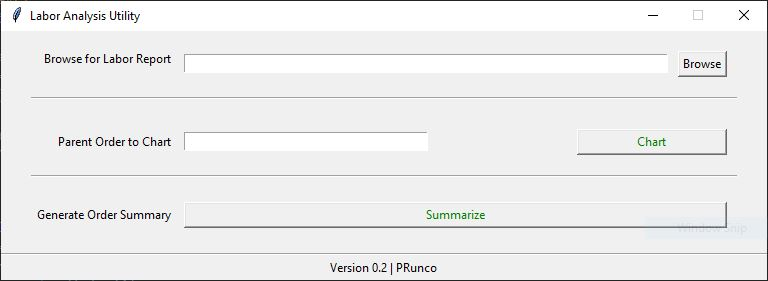

# Labor Reporting Utility (labor-atory)

## About
This helper utility is for analyzing the Traverse Manufacturing App labor report. The utility produces two different views:

1. The first view is gantt-like chart of a single parent order, showing labor transactions by employee and machine for both cutting and kitting events.

2. The second view is a summary report in Excel format of total labor hours, machine hours, and duration hours for all parent orders in the source data.

## Installation
### Window Binary
Download and run the latest [release](https://github.com/paulrunco/labor-atory/releases/).

### Python
If you have Python 3 installed and wish to run the tool via the interpreter, clone the repository. Install dependencies and run the app.py script.

#### Dependencies
- Tkinter
- Pandas
- matplotlib

## Instructions for Use
1. From the Traverse Manufacturing App, navigate to "Reports" > "Labor Reporting"
2. Using the "Column Chooser," ensure that the following columns are showing in the report:
    - ParentOrderNo
    - LaborDate
    - Site
    - EmpName
    - Machine
    - ClockIn
    - ClockOut
    - Operation
    - FGKits
    - TotalHours
3. Filter the report to the orders or dates of interest and export the report to your computer
4. From the Labor Utility, click "Browse" and select the exported report
5. Choose either to:
    - analyze individual parent orders by typing in a parent order number (including the "P") into the "Parent Order to Chart" field.
    - summarize the entire report by clicking the "Summarize" button and choosing a location to save the summarized data.

## How to get help
Please submit issues [here](https://github.com/paulrunco/labor-atory/issues) or email the author directly.
